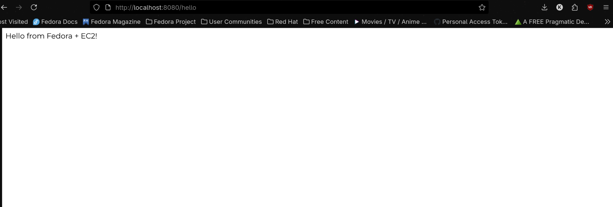

#Dockerized Spring Boot App

This is a  Spring Boot application packaged inside a Docker container. It’s designed to demonstrate basic DevOps principles — containerization, local deployment, and later cloud deployment with CI/CD.

---

##  Tech Stack

- Java 17  
- Spring Boot  
- Maven  
- Docker  
- (Planned) AWS EC2 Deployment  
- (Planned) CI/CD via GitHub Actions  

---

##  Project Structure

devopsdemo/
├── Dockerfile          # Docker build instructions  
├── pom.xml             # Maven configuration  
├── src/                # Application source code  
├── target/             # Compiled output (ignored in .gitignore)  
├── HELP.md             # Spring Boot generated help  

---

## Running Locally with Docker

### 1. Build the JAR file
mvn clean package

### 2. Build Docker Image
docker build -t devopsapp .

### 3. Run the App
docker run -p 8080:8080 devopsapp

Then visit:  
http://localhost:8080/hello

---

## 🐳 Dockerfile Used

FROM openjdk:17-jdk-slim  
COPY target/devopsdemo-0.0.1-SNAPSHOT.jar app.jar  
ENTRYPOINT ["java", "-jar", "/app.jar"]

---

## 🖼 Screenshot

---

##  Future Scope

-  AWS EC2 deployment (in progress)  
-  GitHub Actions CI/CD  
-  Monitoring with Prometheus/Grafana  
-  Logs with ELK stack  

---

